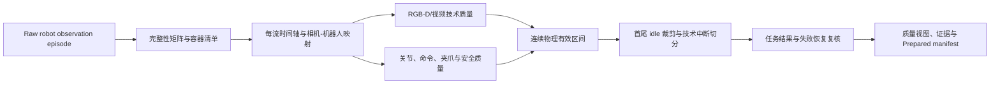

# 无人体手部观测数据源清洗方案

> 状态：调研与落地方案 v1.0
> 日期：2026-07-30
> 范围：没有人体手部可见，或手部检测不适用的机器人/真机视频；覆盖当前的遁甲、UMI 和 A2D。

## 1. 结论

无人体手部并不表示视频没有可学习的操作，也不应被 Stage 9 的 `HAND_ABSENT`
判为低质量。对于机器人夹爪/末端执行器拍摄的第一视角，或固定相机拍摄机械臂、夹爪和
任务台面的数据，清洗目标应从
“手是否出现、是否可跟踪”切换为以下五件事：

1. **观测是否可信**：RGB/RGB-D 是否可解码、清晰、连续，关键操作区域是否可见。
2. **时间和空间是否可信**：相机帧、机器人 state/action、夹爪和标定是否有可证明的对应关系。
3. **机器人行为是否可信**：状态、命令和安全信号没有损坏、长 gap、越限、异常抖动或不可解释的延迟。
4. **片段是否包含可用经验**：裁掉确定的前后空闲、切开技术中断；操作失败和恢复另行标注，而非混入技术坏片段。
5. **任务语义是否可信且不过度重复**：任务对象、动作、结果与来源标注一致，重复采集不会主导训练集。

因此，ZPDS 应把“手部”建模为**质量视图的可选观测**，而不是所有视频的硬门。
不同机器人源的主质量视图不同：A2D 为 `robot_observation_ready` 和
`robot_bc_ready`，UMI 为 `robot_observation_ready`、`bimanual_umi_ready` 和
`vio_ready`，遁甲为 `robot_observation_ready` 和 `end_effector_visible`。若以后需要从
图像识别人手、末端执行器或物体，再增加相应的附加视图，不能改变原始清洗结论。

## 2. 适用性先于检测结果

### 2.1 当前 `datasets/` 的实际观测审计

以下分类依据本地原始流、Reader topic 和抽样画面，而不是目录名。抽样用于确认观测主体，
Profile 配置仍应以来源级规则为准，不应由某一帧的模型空输出决定。

| 数据源 | 本地证据 | `human_hand` | 正确的主清洗方向 |
|---|---|---|---|
| 墨现 Guida ego | `color.mp4` 约 5 秒画面明确包含双手；有头戴 RGB-D 和 IMU | `applicable` | 继续手部检测、手-物/操作质量、视频/深度/IMU 质量 |
| 遁甲 ego MCAP | `*.cache.mp4` 约 5 秒画面可见双机器人夹爪；原始流是多路相机、深度和 IMU | `not_applicable` | 末端执行器可见性、RGB-D、相机时序、IMU、场景/操作语义；不要将夹爪送入人体手模型 |
| 简智新创 UMI | `robot0/robot1_camera0.cache.mp4` 约 8 秒画面可见双夹爪；MCAP 有双端相机、IMU、磁编码器和 VIO 末端位姿 | `not_applicable` | 双端同步、夹爪/物体可见性、VIO 有效性、磁编码器语义和相对运动；不运行人体手检测 |
| A2D 真机 | `camera/100/head_color.jpg`、`hand_left_color.jpg` 可见机器人夹爪；HDF5/ROS 记录关节和夹爪 state/action | `not_applicable` | RGB-D、相机-机器人对齐、关节/命令/夹爪、安全信号、任务结果 |
| EPIC-KITCHENS-100 衍生包 | 本地仅有 hand-object/mask 自动标注 `.pkl`，README 明确原视频位于外部仓 | `unavailable`（本地） | 先隔离解析并校验自动标注；取回且核验原视频后才是 `applicable`，可运行/复核手部模型 |

这里的“无人体手部”不等于“画面无执行器”。遁甲、UMI、A2D 恰恰应把**机器人夹爪/末端
执行器和操作工作区**作为可见性与操作质量的核心观测对象；它们与人手的类别、几何、运动学
和失败模式不同，不能复用人体手的 presence ratio 或 21 点关键点指标。

### 2.2 需要区分的三种情况

| 情况 | 例子 | Stage 9 / 手部模型处理 | 质量含义 |
|---|---|---|---|
| `applicable` | 头戴 ego 视频，人手预期进入画面 | 运行手部检测和跟踪 | 无手可能是动作/视角问题，需按金标阈值判断 |
| `not_applicable` | 遁甲/UMI 夹爪相机、A2D 机器人相机、纯仿真机器人视角 | 不运行，或记录 `not_applicable` | 不能产生 `HAND_ABSENT`，也不能降低总体质量 |
| `unavailable` | 设计上应有手，但视频/模型/算力不可用 | 明确记录未完成的原因 | 不能伪装成“未检测到手”；需要隔离或允许带 flag 的质量视图 |

`not_applicable` 必须由 `SourceProfile` 或 session 的 `observation_agent` 元数据在
检测前确定，不能通过“模型输出为空”倒推。建议最少记录：

```yaml
quality_views:
  robot_observation_ready:
    required: [stage0, stage1, stage2, stage3, stage4, stage7]
    optional: [stage5, stage8, stage10, stage11]
  robot_bc_ready:
    required: [stage0, stage1, stage2, stage3, stage4, stage7, stage8]
    optional: [stage5, stage10, stage11]
modalities:
  human_hand:
    applicability: not_applicable
    reason: robot_end_effector_observation
  end_effector:
    applicability: applicable
```

上述配置是方案中的目标契约；当前 `QualityMetric` 尚未表达 applicability，实施时应
先扩展持久化报告/manifest，**不要**以伪造零分或 `HAND_ABSENT` 代替。

### 2.3 不以单一总分决定去留

一个片段可同时具有 `video_ready=true`、`robot_bc_ready=false`、
`geometry_ready=unavailable`。例如相机到关节的时间映射不可信时，RGB 可保留给
视觉表征或语义任务，但不可导出为监督 state-action 对。质量报告至少写入：

```text
metric_name, value, unit, applicability, severity, disposition,
reason_code, start_ns/end_ns, evidence_uri, producer/version, config_hash
```

Raw Session 保持不可变；清洗只生成有版本的 manifest、对齐表、证据和派生产物。

## 3. 调研依据与设计原则

- **RoboMIND** 将轨迹平滑、遮挡/模糊、重复抓取、碰撞、放置失败、末端执行器出画和
  掉帧分开复核，说明机器人数据不能只依赖视频质量；问题应带时间戳和类别
  [论文](https://arxiv.org/abs/2412.13877)。
- **AgiBot World** 的质量闭环把开头长 idle 和错误后成功恢复区别处理：前者避免让策略
  学习无效等待，后者作为有价值的失败恢复经验保留
  [论文](https://arxiv.org/abs/2503.06669)。
- **DROID** 对相机标定做几何投影、mask 一致性、关键点重投影和鲁棒离群值过滤；有标定
  文件并不等价于标定可用 [论文](https://arxiv.org/abs/2403.12945)。
- **Open X-Embodiment** 的多机器人统一接口表明，数据源的真实频率、动作含义和观测视角
  必须保留，统一训练时间格只能是显式派生视图
  [项目](https://github.com/google-deepmind/open_x_embodiment)。

这些结论与仓库既有的多源调研一致：A2D 有多相机 RGB-D、HDF5、ROS2 MCAP 和多套时钟；
UMI 有双端相机、磁编码器和 VIO；遁甲有多相机、深度和 IMU。各源的相机 frame index、
HDF5 行、ROS/MCAP 消息并非天然一一对应。因此不能按行号硬配对，也不能仅凭视觉判断轨迹
质量。参考现有
[Prepared 清洗调研计划](/Users/xupeihong/Desktop/研究生/Ziki/ZPDS/docs/ZPDS_prepared_segments_清洗调研与实施计划.md)
第 8.4 节与 [项目约定](/Users/xupeihong/Desktop/研究生/Ziki/ZPDS/docs/AGENTS.md)。

## 4. 无手部源的分层清洗内容与方法

按成本从低到高执行。任一层的硬故障只影响其依赖的质量视图，除非该流是当前视图的
必需流。

| 层级 | 清洗什么 | 方法和证据 | 典型处置 |
|---|---|---|---|
| 0-1 来源/结构 | 文件缺失、hash 变化、容器/HDF5/ROS schema 损坏、必需流缺失 | inventory + SHA-256；HDF5 key/shape/dtype/attrs；MCAP/ROS topic、schema、索引和消息数；A2D 建 `head/left/right x color/depth` completeness matrix | 缺必需资产或不可解码：`reject`；可选流缺失：`keep_with_flag` |
| 2 时间/对齐 | 时间回退、长 gap、时钟不明、相机-机器人错误映射 | 每流单独检查单调性、频率和 gap；建立 `frame_index -> camera_timestamp -> robot_row/timestamp` 表；记录 `mapping_method`、误差和不确定度；禁止跨 reset/长 gap 插值 | 受影响连续区间 `trim`/`split`；无可证明映射时保留 RGB、隔离 `robot_bc_ready` |
| 3-5 画面/RGB-D | 黑屏、过曝、模糊、冻结、丢/重帧、深度无效、RGB-D 不配对 | 低采样帧统计灰度、饱和比例、Laplacian 方差、感知 hash/SSIM；解码序列帧间时间；深度 invalid/zero/饱和比例、dtype/单位和配对 offset | 连续坏帧裁剪或切分；全段不可见/不可解码才 `reject` |
| 7 机器人状态 | NaN/Inf、关节越限、错误码、温度异常、状态冻结、速度/加速度/jerk 异常 | 按真实时间差而非样本号差分；先确认 joint name/单位/控制模式；速度、加速度、jerk 用分位数/MAD 发现离群，再按设备额定范围复核；保存 joint、时间段和原始值 | 传感器损坏、越限或安全故障：`quarantine` 或切开；静止本身仅作为 idle 候选，不是坏数据 |
| 7 机器人命令与夹爪 | action 维度/NaN、命令长 gap、state-action 无覆盖、命令响应滞后、夹爪卡滞/事件缺失 | 命令/state 各自保留时间轴；在可信重叠窗口用延迟扫描或互相关估计 lag，输出 P50/P95 和符号；对夹爪开闭事件核对位置/速度变化，区分“无夹爪动作”和“有命令无响应” | action 不可信时不用于 BC；视频可留；持续有命令无响应或安全异常进入人工复核 |
| 8 几何/可见性 | 内外参缺失、相机移动/换位、目标工作区或末端执行器长期不可见 | 校验内参、外参和分辨率一致；有机器人模型时把末端或已知关键点投影到相机，统计 in-frame ratio 与重投影残差；无可靠几何时用稀疏人工/VLM 复核，标为 `model_estimated` | 标定不可信：禁用几何/跨视角训练视图；不应删除独立可用 RGB |
| 物理分段/idle | 任务前后长空闲、技术中断、重复等待、转场 | 以机器人运动能量 + 夹爪事件 + 视觉变化三信号联合；只裁剪首尾连续 idle；中间低运动区默认保留，除非 review 证明确为无效等待 | 首尾 `trim`；技术间断 `split`；不确定中间停顿 `keep_with_flag` |
| 10 任务语义/结果 | 无任务、错误对象、危险碰撞、失败、恢复、任务未完成、源标注冲突 | 先利用已有 review/action span；对低置信候选生成多视角/状态叠加预览，VLM 或人工稀疏复核；输出 `success`、`failure`、`recovery`、`incomplete`、`unknown`，附证据帧/时间 | 技术损坏与操作结果分开；failure/recovery 默认保留为独立数据视图，只有下游只收成功轨迹时才在 release 过滤 |
| 11 去重/偏差 | 重复 episode、同一场景/轨迹过度集中、清洗后分布失衡 | SHA-256 精确重复；视频 pHash/embedding 候选；对状态轨迹按时间归一化后比较相关性或 DTW；按 session/group 切分避免泄漏；比较清洗前后设备、任务、场景、outcome 分布 | 自动去重仅处理精确重复；近重复进入复核；输出选择应保持来源和结果的覆盖 |

### 4.1 关于阈值

只有文件/Schema 损坏、明确的时间回退、不可解码和已知安全硬限等高精度问题可自动
`reject`。模糊、抖动、idle、lag、可见性和语义结果均需分别以遁甲、UMI、A2D 的金标集
校准；在校准前应
`quarantine` 或 `keep_with_flag`。不要把 ego 手部数据中的帧率、手出现率或 WiLoR 置信度
阈值移植到机器人数据。

对不等采样时序，导数类指标须使用真实 `dt`，且在 `dt <= 0`、跨 gap、缺测值或 reset
附近断开计算。推荐先用每个 joint 的中位数和 MAD 得到候选，再由机械臂型号的额定限值和
人工证据确认，避免把高速但正常的动作误判为异常。

## 5. 机器人末端观测源的建议流水线



### 5.1 遁甲与 UMI 的源级规则

- **遁甲**：把相机中可见的夹爪当作 `end_effector`，不作人手检测。主视角先做 RGB/深度
  画质、帧时序、IMU gap/饱和和相机覆盖；侧相机用于遮挡与末端可见性复核。无机器人关节
  state/action 流时，不能虚构 `robot_bc_ready`，但可发布 `robot_observation_ready` 或
  `end_effector_visible`。
- **UMI**：`robot0` 和 `robot1` 必须分别维护流、时间轴和可见性，再检查双端同步残差、
  相对运动、VIO reset/长 gap、鱼眼标定和磁编码器原始值。磁编码器的物理含义未确认前只能
  作为 raw scalar，不能命名为 gripper action；VIO 不可靠只会阻断 `vio_ready` 或
  `bimanual_umi_ready`，不应拒绝可用视频。
- **A2D**：有 state/action、夹爪和安全相关流，可进一步判断 `robot_bc_ready`。它的
  `hand_left/right` 是腕部相机 stream id，不能被解释成人体左右手，也不能把模型检测为空
  当作视图失败。

### 5.2 A2D 的具体落地步骤

1. **建立证据而非假设对齐。** 读取 `meta_info.json`、三相机目录、RGB-D 标定、
   `aligned_joints.h5`/`raw_joints.h5`、ROS2 MCAP、设备日志、review。计算完整性矩阵，
   并验证 `duration`、clip 边界、实际相机帧数、HDF5 和 ROS 的相互矛盾。每一帧映射均须有
   `direct | inferred | unavailable` 方法、误差和不确定度；不能把“第 N 个 HDF5 行”当成
   “第 N 个相机目录”。
2. **先运行确定性低成本检查。** 解码并抽帧检查视觉问题；检查 RGB-D 成对率；对 state 和
   action 做有限性、维度、关节命名/单位、gap、覆盖率、冻结和错误码检查。已有
   `zpds_prepare/detectors/robot/` 的 `joint_quality.py`、`action_quality.py`、
   `alignment_quality.py`、`gap_detection.py` 可作为实现起点，但其中的阈值仍需按 A2D
   金标校准。
3. **生成 physical span。** 对齐可信的相机、状态和动作公共范围；将明确的坏画面、时钟
   gap、不可用映射和硬件故障标成可切的连续区间。输出 source span 和每流可用性，不重写
   原始频率。
4. **裁剪首尾 idle。** 在 span 两端寻找连续的“低关节/夹爪变化 + 低视觉变化”区间；给出
   最小持续时间和缓冲帧。中段停顿可能是等待接触、视觉伺服或恢复，不自动删除。
5. **语义与结果复核。** 优先导入已有 review 的 action span，并校验它引用的 frame-id
   命名空间。再只对低置信、异常或抽样片段运行 VLM/人工复核，使用带状态曲线、夹爪事件和
   多相机画面的预览。不得把 VLM 结果写成源真值。
6. **按质量视图发布。** 可导出：仅 RGB/Depth 的 `robot_observation_ready`、有可信
   state-action 对的 `robot_bc_ready`、有可信标定的 `geometry_ready`，以及单独的
   `failure_recovery`。后续训练任务在 release 选择视图，不在清洗阶段物理删除其他数据。

## 6. 统一处置规则

| 证据类型 | 处置 | 示例 |
|---|---|---|
| 必需文件缺失、容器不可解析、时间轴不可恢复、全段无可用观测 | `reject` 当前质量视图 | 缺 head RGB 且该视图要求 head RGB；HDF5/MCAP 已损坏 |
| 可定位的技术坏区间 | `trim` 或 `split` | 5 秒冻结、ROS 时间 reset、某段 RGB-D 不配对 |
| 问题存在但无法高置信判坏，或只影响一类训练目标 | `quarantine` / `keep_with_flag` | 推断相机时间且 P95 误差超目标；标定未知；命令流部分 NaN |
| 操作失败、恢复、未完成但技术完好 | 保留，并写 `outcome` | 第一次抓取失败后调整姿态成功；任务超时但画面/轨迹完好 |
| 手部不适用 | Stage 9 记 `not_applicable`，不改变处置 | 遁甲/UMI 夹爪相机、A2D 机器人相机 |

`reject` 是对“某质量视图不可交付”的判断，不等价于删除 Raw，也不必然否定同一 session
在另一视图中的价值。

## 7. 最小落地计划与验收

### 7.1 第一批实现（不引入重模型）

1. 为 `dunjia_ego`、`jianzhi_umi`、`a2d_robot` Profile 增加
   `human_hand: not_applicable` 与 `end_effector: applicable`；Stage 9 只写 INFO/适用性
   记录，不生成 `HAND_ABSENT`。墨现保持 `human_hand: applicable`；EPIC 在缺原视频时为
   `unavailable`。
2. 完成机器人/末端执行器的统一 `Decision` 适配：A2D 复用现有 state/action 检测器并新增
   真实时间轴的 lag、夹爪响应和错误码检查；UMI 增加双端同步、VIO 和磁编码器检查；遁甲
   增加末端可见性、RGB-D 和 IMU 检查。
3. 将 A2D completeness matrix、camera-robot alignment Parquet、UMI 双端对齐表、遁甲相机
   覆盖表、每流 gap 和视觉坏帧 span 写为可复核证据；把不确定映射显式传播到相关质量视图。
4. 以三信号 idle 规则提出首尾裁剪候选，默认只输出候选和预览；人工确认后才固化阈值。
5. 让 segment/revision manifest 保存 quality view、outcome、reason code、配置 hash 和证据 URI。

### 7.2 金标和阈值校准

从三个无人体手源分别按任务、相机、时长和结果分层抽取金标集；每源至少 30 个 episode，
数据量不足则全量。至少两名审阅者独立标注：技术损坏 span、末端/工作区可见性、首尾无效
idle、操作结果、恢复、标定问题；A2D 另标注是否足以做 state-action 监督，UMI 另标注
双端同步和 VIO 是否可用。对分歧做 adjudication，并报告一致率。

验收指标：

- 硬故障规则 precision 接近 100%，避免误删。
- 对齐质量以“可用于 state-action 配对”为金标标签，报告 precision/recall，并按
  `direct` 和 `inferred` 分层。
- idle 裁剪报告边界误差、被错误裁掉的有效动作比例，以及保留的中段等待比例。
- 机器人异常规则报告每个 reason code 的 precision、召回和误报原因；不使用单一总分。
- 发布前后比较来源、设备、任务、场景、动作幅度、success/failure/recovery 的分布，确认
  清洗没有只留下容易、慢速或单一任务的数据。

### 7.3 回归测试

使用小型固定 fixture 覆盖：三个源无人体手但末端可见、墨现有人手、EPIC 缺原视频、缺相机
文件、末帧不完整、相机帧号稀疏、HDF5/相机长度不同、时间回退、跨长 gap 映射、关节 NaN、
关节越限、夹爪有命令无响应、UMI VIO reset、首尾 idle、中段正常等待、失败后恢复。断言
`not_applicable` 不会产生 `HAND_ABSENT`，并断言 `robot_bc_ready` 的失败不会错误拒绝仍可用的
RGB 质量视图。

## 8. 当前边界

- 本方案不建议立即把 VLM、末端分割或接触检测接入全量数据。它们应只作用于低置信候选和
  统计抽检，并保存模型版本、提示词/配置和证据。
- A2D 若没有可恢复的逐帧相机时间，不能宣称精确同步；可保留带不确定度的近邻映射，或仅
  发布 RGB 视图。
- 机器人末端“在画面中”不等价于任务正确，任务成功也不等价于轨迹适合作为 BC 监督；二者
  分别报告。
- 现有 `zpds/qc/stage7_robot.py`、`stage8_calibration.py`、`stage10_semantic.py` 仍是
  骨架。本文件是落地顺序和契约，不宣称这些 Stage 已实现。
